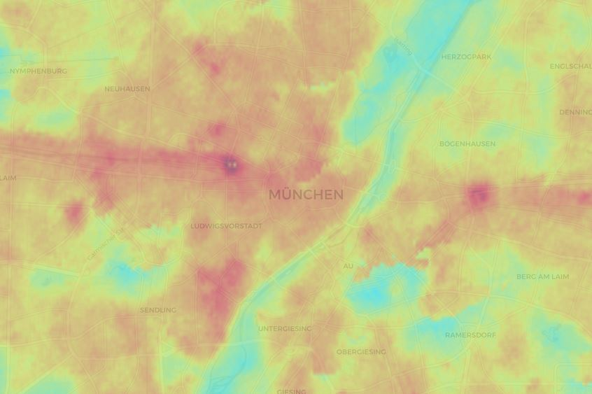
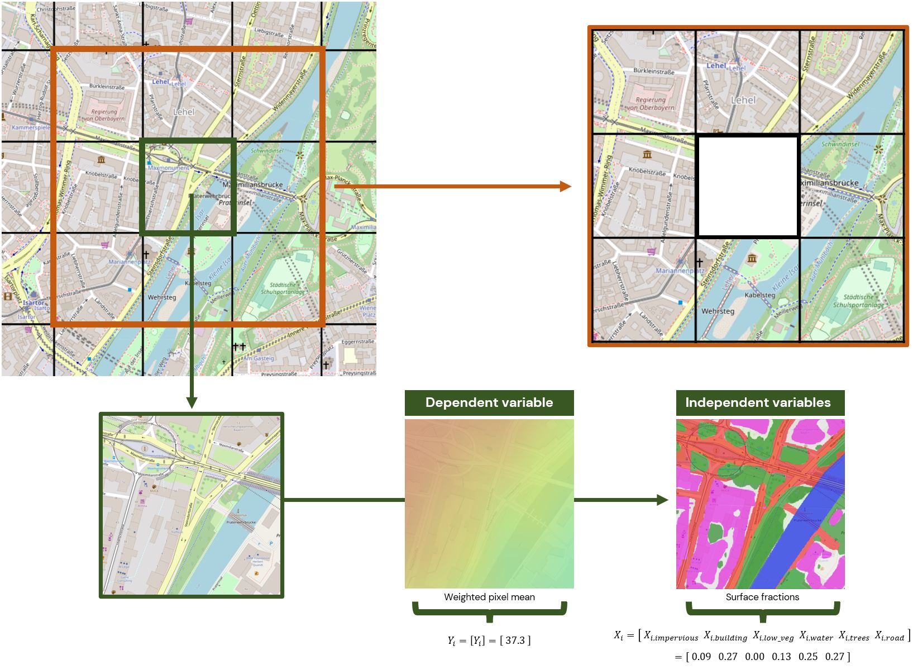

# **HeatMapper:** Modeling urban heat intensity

    
     
    &copy; OpenStreetMap

## Background

Increasing urbanisation and climate change have led to the evolving and intensification of urban heat islands which can be defined as local areas where the temperature is considerably higher than in their vicinity. High temperatures in general are inevitably associated with partly drastical consequences for human health. However, heat reduction measures are available that can deal with the urban heat island effect: Increasing vegetation, cutting the amount of impervious surfaces, etc.. The goal of this project is to identify heat islands by analysing applicable data for the city of Munich and to model the impact of additional heat reduction measures on potential temperature occurences.

## Approach

This project uses land surface temperature data from Ecostress and official property data as well as orthophotos from the Bavarian State Office for Digitisation, Broadband and Surveying. The former data source denotes the dependent variable in our analysis. The latter two data sources were used to extract land usage / land cover (LULC) characteristics forming the basis of our feature set. We used pre-trained and fine-tuned neural networks to reach a granular segregation of land cover to also detect patterns that are not stored in official data.

    
     
    &copy; OpenStreetMap

We disaggregated the data by dividing the city and surrounding of Munich into 250m by 250m squares and then fitted a spatial cross-regressive model to numerically estimate the relationship of urban heat intensity and LULC characteristics. The model accounts for geospatial dependencies by incorporating spatial lags into the feature set (i.e. accounting for the neighborhood of an observation).

### App

This econometric model is at the core of our application which can be found [here](http://193.196.54.113:8050/). The website also provides a [blog article](http://193.196.54.113:8050/Hintergrund) focusing on the technical details of this project.

### Code

We have only used the programming language Python in the context of this research project. This GitHub repository hosts all the code from data acquisition to statistical modeling to app source code. 

 

---
This project was part of the module DS500 "Data Science Project" of the Data Science in Business and Economics Master degree at the University of Tuebingen.
